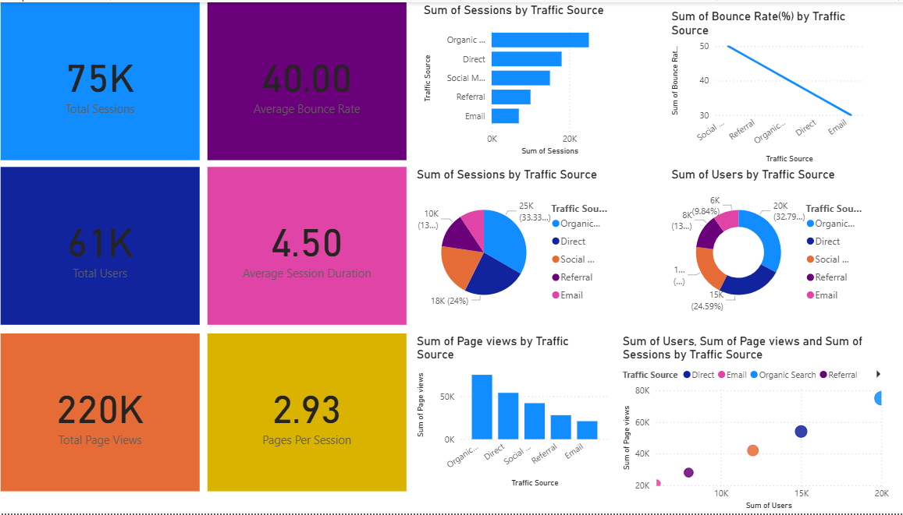

# Website Traffic Analysis Dashboard

## Project Overview
This Power BI dashboard analyzes website traffic and user engagement. It helps monitor visitor behavior, traffic sources, and website performance using interactive visualizations.

## Tools Used
- Power BI
- Microsoft Excel
- GitHub

## Dashboard Features
- Total Website Visitors
- Sessions Analysis
- Bounce Rate
- Traffic Source Distribution
- Device-wise Traffic
- Top Performing Pages
- Monthly Website Traffic Trend

## Key Insights
- Organic Search generated the highest traffic.
- Mobile users contributed more visitors than desktop users.
- Bounce rate was highest for social media traffic.
- Peak website traffic occurred during weekends.
- Returning visitors showed higher engagement than new visitors.

## Files Included
- dashboard3.pbix – Power BI Dashboard
- db3.png – Dashboard Screenshot

## Dashboard Preview

